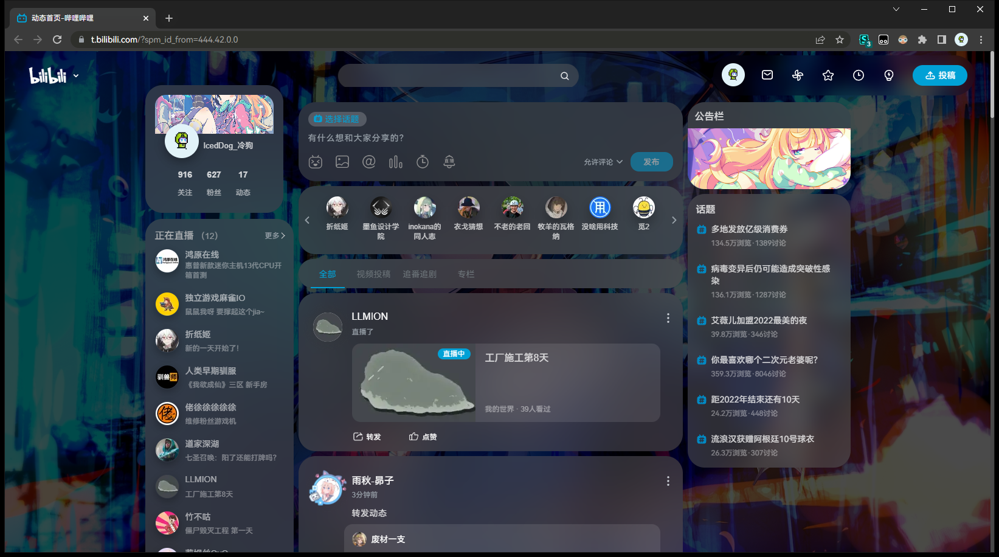
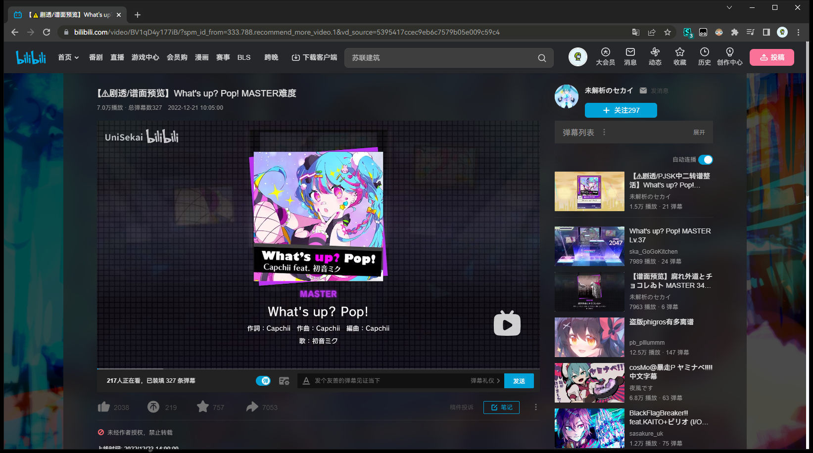
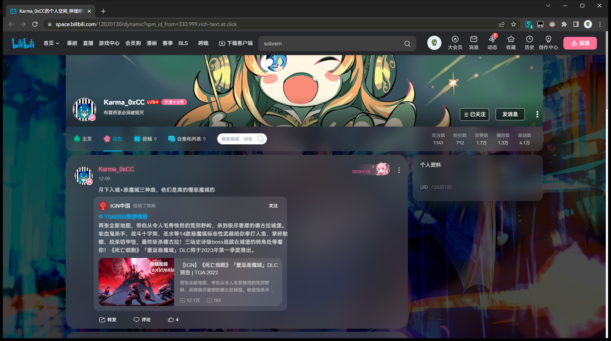
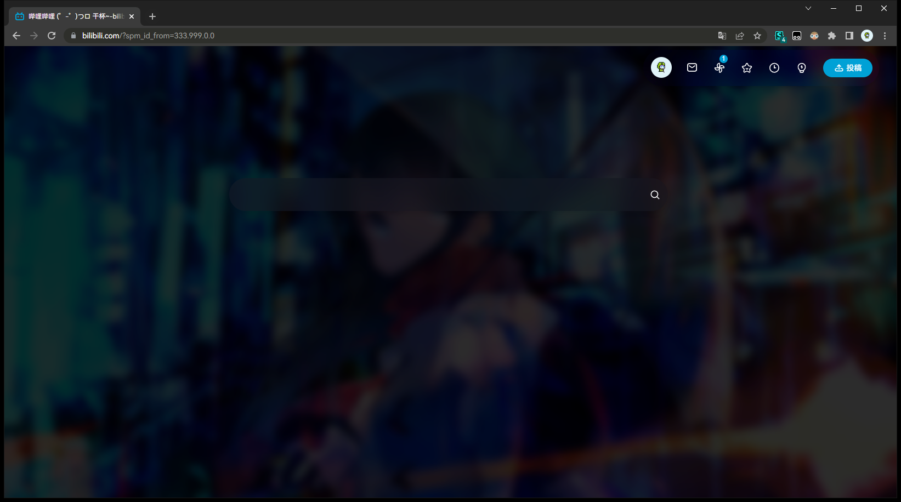

# some bilibili css

hi. this is some bilibili custom userscript that i used and modified over the course of months.

i randomly adjusted things when i see things i dont like.

doesnt support customization, because i made this for myself.

---

**Usage:**

dump all of them them into [stylus](https://stylus-lang.com/) and turn them all on

adjust a few settings if they need to (like changing to dark mode or what. i forgor)

then finished

also you should not use the new version of UI on bilibili

that sh*t sucks and it breaks the code

---

**where i steal the code from**

https://github.com/hakadao/bilibili-simple-home

https://github.com/xiaofeiTM233/bilibili-activity-theme

https://github.com/tolking/usercss/tree/master/bilibili-palette

(???)

**where i steal the pictures from**

https://osu.ppy.sh/beatmapsets?q=nanahira%20pack%20vol&s=any

↑ all the images come from the first four search results

---

**pics that are obviously not showing the crappy part which i have not finished**

