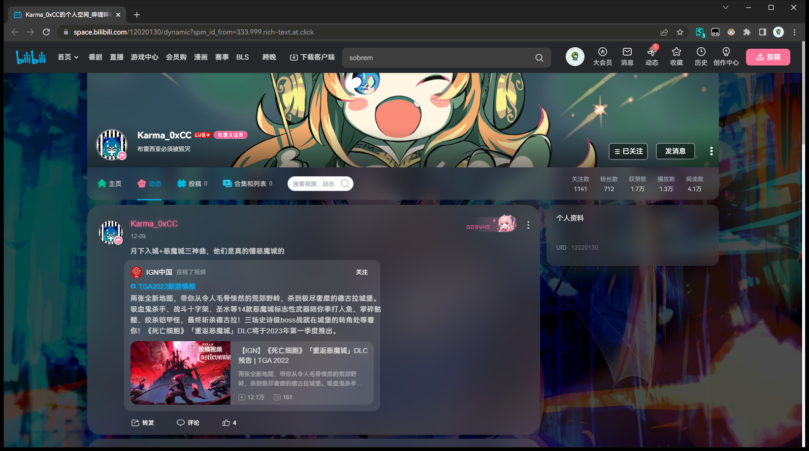
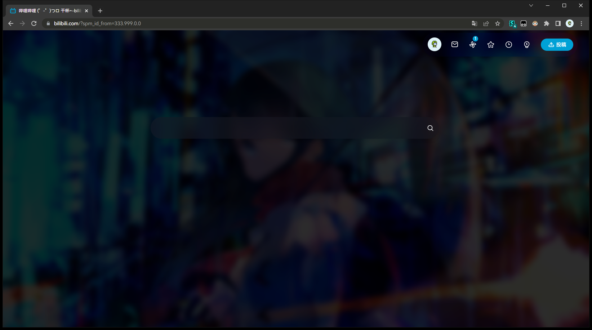

# some bilibili css

hi. this is some bilibili custom userscript that i used and modified over the course of months.

i randomly adjusted things when i see things i dont like.

doesnt support customization, because i made this for myself.

---

**Usage:**

dump all of them them into [stylus](https://stylus-lang.com/) and turn them all on

adjust a few settings if they need to (like changing to dark mode or what. i forgor)

then finished

---

**where i steal the code from**

https://github.com/hakadao/bilibili-simple-home

https://github.com/xiaofeiTM233/bilibili-activity-theme

https://github.com/tolking/usercss/tree/master/bilibili-palette

(???)

---

**pics that are obviously not showing the crappy part which i have not finished**

_~(H8@4DGYW5R4T8R86.png)
DU9$S@_J$X.png)

